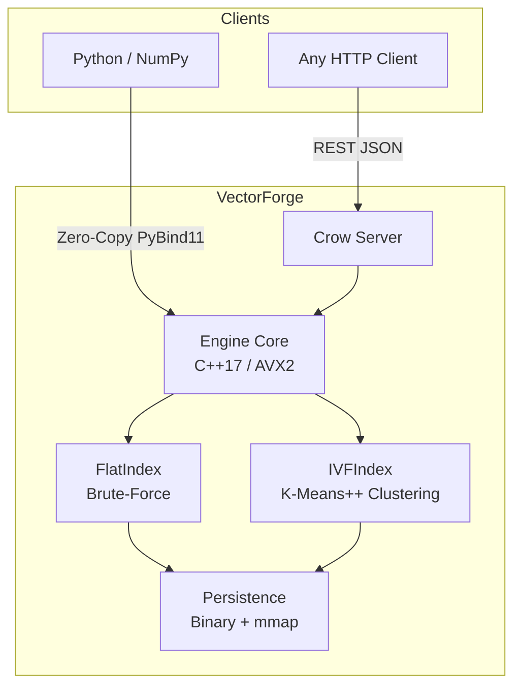
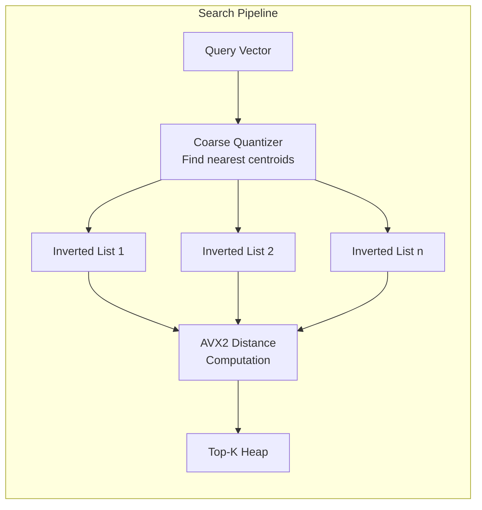
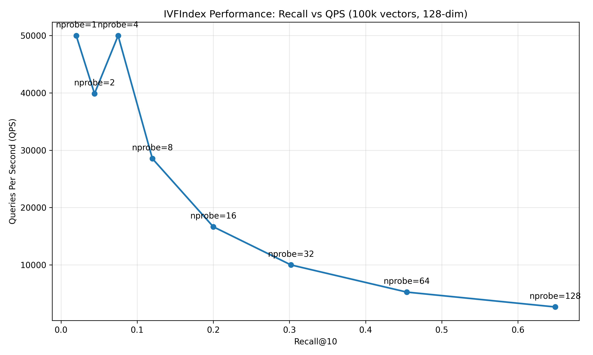

# VectorForge

A production-grade vector search engine written from scratch in C++17. Built with AVX2/FMA3 SIMD intrinsics, IVF indexing with K-Means++ clustering, memory-mapped persistence, zero-copy Python bindings, and an HTTP REST API.

---

## Features

- **Brute-force and IVF indexing** — exact kNN search via `FlatIndex`, or sub-linear approximate search via `IVFIndex` with tunable recall.
- **AVX2/FMA3 SIMD acceleration** — hand-written intrinsics with loop unrolling and FMA accumulation for L2, inner product, and cosine distance.
- **Thread-safe concurrency** — `std::shared_mutex` for concurrent readers with exclusive writer locks. Parallel search and indexing via a custom thread pool.
- **Zero-copy Python bindings** — PyBind11 with `py::buffer_protocol` for direct NumPy memory access. GIL released during all C++ compute paths.
- **REST API** — standalone HTTP microservice using Crow. JSON endpoints for vector insertion, search, and index statistics.
- **Memory-mapped persistence** — binary `.vdb` format with `mmap` (POSIX) and `CreateFileMapping` (Windows) for zero-copy disk I/O.

---

## Architecture





---

## Benchmarks

All benchmarks ran on a single machine. Reproducible via `python benchmarks/benchmark.py`.

### FlatIndex — SIMD vs NumPy

Brute-force L2 search over 10,000 vectors at 128 dimensions, single-threaded:

| Method | QPS | Relative |
| :--- | ---: | ---: |
| NumPy (`np.sum`) | 411 | 1.0x |
| **VectorForge FlatIndex** | **1,434** | **3.5x** |

### IVFIndex — Recall vs Throughput

100,000 vectors, 128 dimensions, 1,024 clusters, 8 threads:

| n_probes | Recall@10 | QPS |
| ---: | ---: | ---: |
| 1 | 0.020 | 49,985 |
| 2 | 0.044 | 39,881 |
| 4 | 0.075 | 49,979 |
| 8 | 0.120 | 28,542 |
| 16 | 0.200 | 16,651 |
| 32 | 0.302 | 9,994 |
| 64 | 0.454 | 5,257 |
| 128 | 0.649 | 2,665 |

<p align="center">
  
</p>

---

## Project Structure

```
VectorForge/
├── CMakeLists.txt
├── README.md
│
├── include/vectorforge/          # Public headers
│   ├── types.h                   # SearchResult, MetricType enum
│   ├── distance.h                # SIMD + scalar distance declarations
│   ├── flat_index.h              # Brute-force index
│   ├── ivf_index.h               # IVF-Flat index
│   ├── kmeans.h                  # K-Means++ clustering
│   └── thread_pool.h             # Task-based thread pool
│
├── src/                          # Implementation
│   ├── distance.cpp              # AVX2/FMA3 intrinsics + scalar fallback
│   ├── flat_index.cpp            # Contiguous buffer search with shared_mutex
│   ├── ivf_index.cpp             # Inverted file build + multi-probe search
│   ├── kmeans.cpp                # K-Means++ init + Lloyd's iterations
│   └── thread_pool.cpp           # Worker threads + condition variable queue
│
├── api/
│   └── server.cpp                # Crow HTTP server with JSON endpoints
│
├── python/
│   └── bindings.cpp              # PyBind11 module (zero-copy NumPy interop)
│
├── tests/
│   ├── test_distance.cpp         # SIMD vs scalar correctness
│   ├── test_flat_index.cpp       # Brute-force search + concurrency
│   ├── test_ivf_index.cpp        # IVF build + recall verification
│   ├── test_kmeans.cpp           # Clustering convergence
│   ├── test_persistence.cpp      # Save/load round-trip
│   ├── test_thread_pool.cpp      # Concurrency correctness
│   ├── test_python_bindings.py   # Python bindings verification
│   └── test_api.py               # REST endpoint tests
│
├── benchmarks/
│   └── benchmark.py              # QPS + recall measurement + chart generation
│
└── scripts/
    └── generate_test_data.py     # Random vector generation for testing
```

---

## Build

Requires CMake 3.16+, a C++17 compiler with AVX2 support, and Python 3.8+ (for bindings).

```bash
git clone https://github.com/Rudyy75/VectorForge.git
cd VectorForge

cmake -B build
cmake --build build --config Release
```

CMake will automatically fetch GoogleTest, PyBind11, Crow, ASIO, and nlohmann_json via `FetchContent`.

---

## Usage

### C++: Direct Library

```cpp
#include "vectorforge/flat_index.h"

vectorforge::FlatIndex index(128, vectorforge::MetricType::L2);

// Insert vectors
index.add(0, data_ptr);

// Search
auto results = index.search(query_ptr, /*k=*/10);
for (const auto& r : results)
    std::cout << "id=" << r.id << " dist=" << r.distance << "\n";
```

### Python: Zero-Copy NumPy

```python
import numpy as np
import vectorforge

dim = 128
dataset = np.random.rand(100_000, dim).astype(np.float32)
ids = np.arange(100_000).astype(np.uint64)

pool = vectorforge.ThreadPool(8)
index = vectorforge.IVFIndex(dim, nlist=1024, metric=vectorforge.MetricType.L2)
index.train(dataset, pool)
index.add(dataset, ids, pool)

index.set_nprobe(16)
distances, result_ids = index.search(dataset[:1], k=10, pool=pool)
```

### REST API

Start the server:
```bash
./build/vectorforge_server
```

Insert vectors:
```bash
curl -X POST http://localhost:8080/vectors/add \
  -H "Content-Type: application/json" \
  -d '{"vectors": [{"id": 1, "vector": [0.1, 0.2, 0.3]}]}'
```

Search:
```bash
curl -X POST http://localhost:8080/search \
  -H "Content-Type: application/json" \
  -d '{"vector": [0.1, 0.2, 0.3], "k": 5}'
```

Index stats:
```bash
curl http://localhost:8080/stats
```

---

## Tech Stack

| Layer | Technology |
| :--- | :--- |
| Core | C++17 (`shared_mutex`, move semantics, structured bindings) |
| SIMD | AVX2 + FMA3 intrinsics |
| Build | CMake 3.16+ with FetchContent |
| Testing | GoogleTest |
| Python | PyBind11 (zero-copy buffer protocol) |
| REST | Crow (header-only HTTP framework) |
| JSON | nlohmann/json |
| Persistence | `mmap` (POSIX) / `CreateFileMapping` (Windows) |
